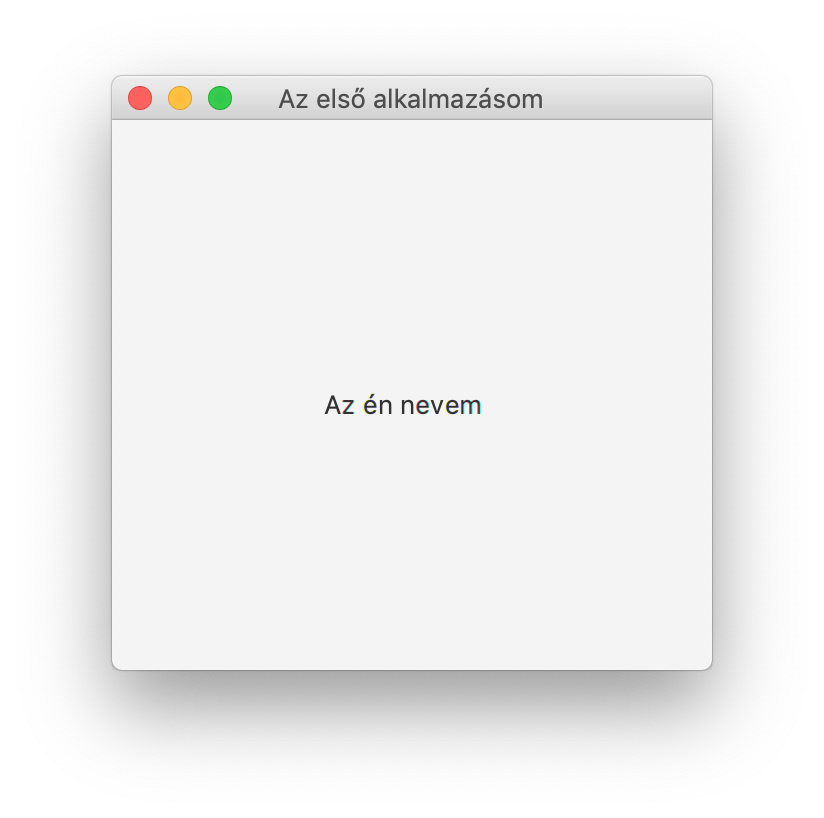
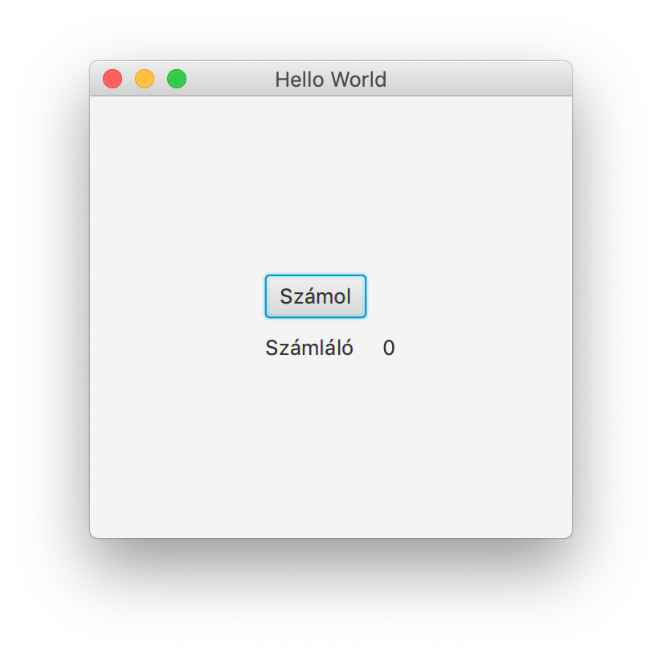
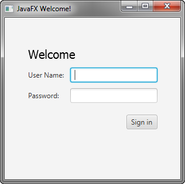

# SQL és GUI

  - materials and homework:
    - javafx
    - sql
  - outline
    - javafx mat review
    - 1-2 display
    - 1-2 user interaction
    - 1-2 complex app
    - lunch
    - sql mat review
    - half sql day

## Házi feladat

| Tananyag | Hossz |
| -------- | ----- |
| [JavaFX alapismeretek (15 videó)](https://www.youtube.com/playlist?list=PLyriihBWoulyW2h7YOfrLLeaF9Pjndl5f) | ~1:55:00 |
[SQL alapismeretek (16 videó)](https://www.youtube.com/playlist?list=PLyriihBWoulwTSXslcLo-kui43K6cM2zD) | ~1:46:00 |

## JavaFX

### Házi feladat ellenőrzés
- MVC
- FXML
  - konténerek
  - vezérlőelemek
  - menü
  - attribútumok (id, onAction)
- Controller
  - @FXML annotáció
  - ActionEvent
  - osztályváltozók és metódusok

### Feladatok

#### Feladat 1

- Készíts grafikus megjelenítésű programot, amelyben megjeleníted a saját neved egy Labelen, valamint az ablak címe: "Első alkalmazásom".

#### Feladat 2

- Készíts egy egyszerű alkalmazást, ahol 3 elem található, két Label és egy Button. Az egyik label egy számértéket kell tartalmazzon, ami a Button megnyomására növekszik eggyel.

- Adj hozzá még egy gombot, amely lenullázza a számlálót!
- Adj hozzá még egy gombot, amely csökkenti eggyel a számlálót!

#### Feladat 3

- Készíts alkalmazást, amelybe be lehet jelentkezni
- Készíts osztályt a felhasználónak, és legalább 3 különböző felhasználót hozz létre a program indulásakor
- Ha a bejelentkezés sikeres, tüntesd el a bejelentkező képernyőt és üdvözöld a felhasználót
- Ha sikertelen, jelenítsd meg a bejelentkezőképernyőn tetszésed szerinti formában

#### Feladat 4

- Készíts egy egyserű szövegszerkesztő alkalmazást
- A Layout elemei legyenek:
  - Megnyitás gomb
  - Mentés gomb
  - Fájlnév szöveges input mező
  - Fájl tartalom szöveges input doboz
- Megnyitás gombra kiválaszthatunk egy fájlt, amely neve bekerül a Fájlnév mezőbe és a tartalma pedig a dobozba
- Mentés gombra kattintva az aktuális fájlnevet használva az alkalmazás lementi a tartalmat

## SQL

### Házi feladat ellenőrzés

- Mi az adat?
  <!--
    In simple words data can be facts related to any object in consideration.
  -->
- Mi az adatbázis?
  <!--
    Database is a systematic collection of data. Databases support storage and
    manipulation of data.
  -->
- Mit jelent a Struktúrált Lekérdező Nyelv?
  <!--
     The standard language for dealing with Relational Databases.
  -->
- Mi a relációs adatbázis?
  <!--
    It defines database relationships in form of tables, also known as
    relations. Relational DBMS usually have pre-defined data types that they can
    support.
    You can mention the other type of DBMS here.
  -->
- Mi egy tábla?
  <!--
    A table is a collection of related data held in a structured format within
    a database.
  -->
- Mi egy mező/oszlop?
  <!--
    In a relational database, a column is a set of data values of a particular
    simple type, one value for each row of the database.
  -->
- Milyen tipusú adat lehet egy oszlopban?
  <!--
    Numeric, string, date and time
  -->
- Milyen kapcsolatok léteznek táblák között?
  <!--
    One-to-one
    One-to-many, many-to-one
    Many-to-many
  -->
- Mi az elsődleges kulcs, miért fontos?
  <!--
    The PRIMARY KEY constraint uniquely identifies each record in a table.
    Primary keys must contain UNIQUE values, and cannot contain NULL values.
    A table can have only one primary key, which may consist of single or multiple fields.
  -->
- Mi a külső kulcs, miért fontos?
  <!--
    A FOREIGN KEY is a key used to link two tables together.
    A FOREIGN KEY is a field (or collection of fields) in one table that refers
    to the PRIMARY KEY in another table.
  -->
- Mit jelent a CRUD?
  <!--
    Create
    Read or Retrieve
    Update
    Delete
  -->
- Hogyan hozhatunk létre adatbázist?
  <!--
    CREATE DATABASE database;
  -->
- Hogyan válthatunk másik adatbázisra?
  <!--
    USE database;
  -->
- Hogyan hozhatunk létre táblát?
  <!--
    CREATE TABLE table (colum1 type, column2 type);
  -->
- Hogyan nézhetjük meg milyen táblák vannak az adatbázisban?
  <!--
    SHOW TABLES;
  -->
- Hogyan nézhetjük meg egy tábla oszlop definícióit?
  <!--
    DESCRIBE table;
  -->
- Hogyan kérdezhetjük le egy táblából az összes adatot?
  <!--
    SELECT * FROM table;
  -->
- Hogyan kérdezhetünk le csak bizonyos oszlopokat?
  <!--
    SELECT column1, column2 FROM table;
  -->
- Hogyan kérdezhetünk le csak bizonyos sorokat?
  <!--
    SELECT * FROM table WHERE column1=value;
  -->
- Milyen operátorokat lehet használni?
  <!--
    =, >, <, <>, LIKE, BETWEEN ... AND ..., LIKE, NOT, IS NULL
    https://dev.mysql.com/doc/refman/8.0/en/non-typed-operators.html
  -->
- Hogyan adhatunk hozzá adatot egy táblához?
  <!--
    INSERT INTO table (column1, column2) VALUES (value1, value2), (value1, value2);
  -->
- Hogyan módosíthatunk adatot egy táblában?
  <!--
    UPDATE table SET column1=value1, column2=value2;
  -->
- Hogyan törölhetünk adatot egy táblából?
  <!--
    DELETE FROM table;
  -->
- Hogyan lehet lekérdezni a csak különböző értékű adatokat?
  <!--
    SELECT DISTINCT * FROM table;
  -->
- Hogyan lehet az eredmény sorrendjén változtatni?
  <!--
    SELECT * FROM table ORDER BY column1;
  -->
- Melyek a leggyakoribb aggregáló függvények?
  <!--
    COUNT
    AVG
    MIN
    MAX
  -->
- Hogyan kérdezhetünk le egyszerre több táblából?
  <!--
    SELECT * FROM table1 LEFT JOIN table2 ON table1.column1 == table2.column1;
    SELECT * FROM table1 INNER JOIN table2 ON table1.column1 == table2.column1;
  -->

### Feladatok

- [SQLBolt - Introduction to SQL](https://sqlbolt.com/lesson/introduction)
- [SQLBolt - SQL Lesson 1: SELECT queries 101](https://sqlbolt.com/lesson/select_queries_introduction)
- [SQLBolt - SQL Lesson 2: Queries with constraints (Pt. 1)](https://sqlbolt.com/lesson/select_queries_with_constraints)
- [SQLBolt - SQL Lesson 3: Queries with constraints (Pt. 2)](https://sqlbolt.com/lesson/select_queries_with_constraints_pt_2)
- [SQLBolt - SQL Lesson 4: Filtering and sorting Query results](https://sqlbolt.com/lesson/filtering_sorting_query_results)
- [SQLBolt - SQL Lesson 13: Inserting rows](https://sqlbolt.com/lesson/inserting_rows)
- [SQLBolt - SQL Lesson 14: Updating rows](https://sqlbolt.com/lesson/updating_rows)
- [SQLBolt - SQL Lesson 15: Deleting rows](https://sqlbolt.com/lesson/deleting_rows)
- [SQLBolt - SQL Lesson 16: Creating tables](https://sqlbolt.com/lesson/creating_tables)
- [SQL Movie-Rating Query Exercises](https://lagunita.stanford.edu/courses/DB/SQL/SelfPaced/courseware/ch-sql/seq-exercise-sql_movie_query_core/)
  - Q1, Q2, Q3, Q4, Q5
