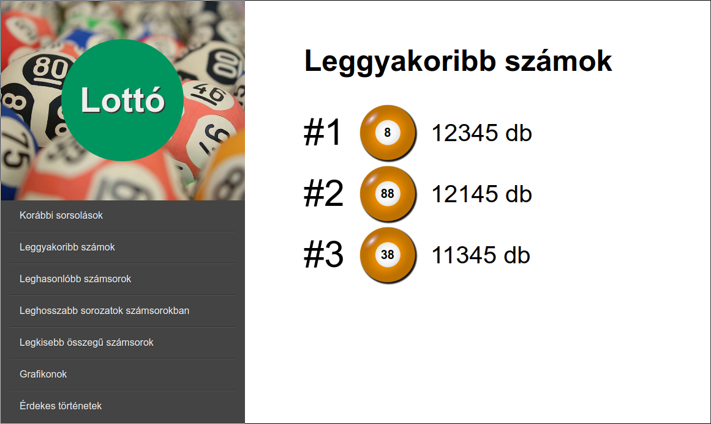
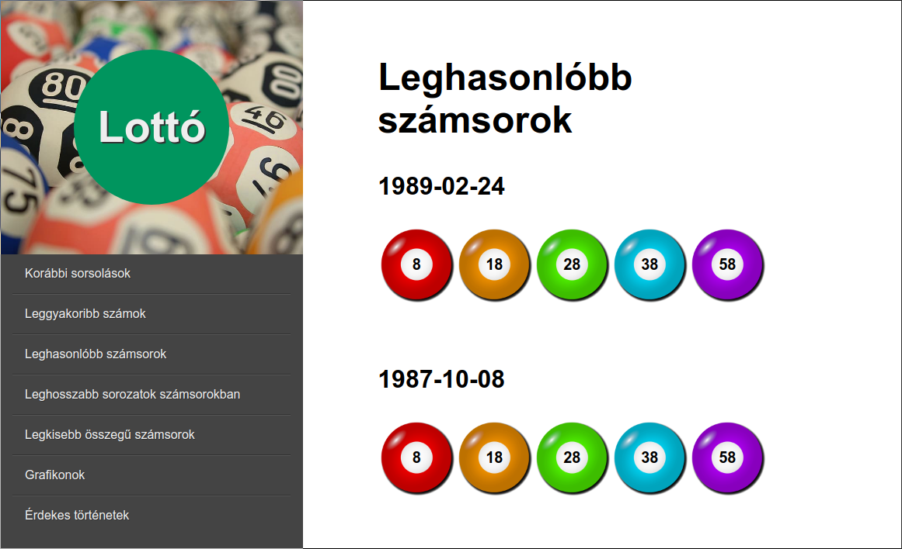
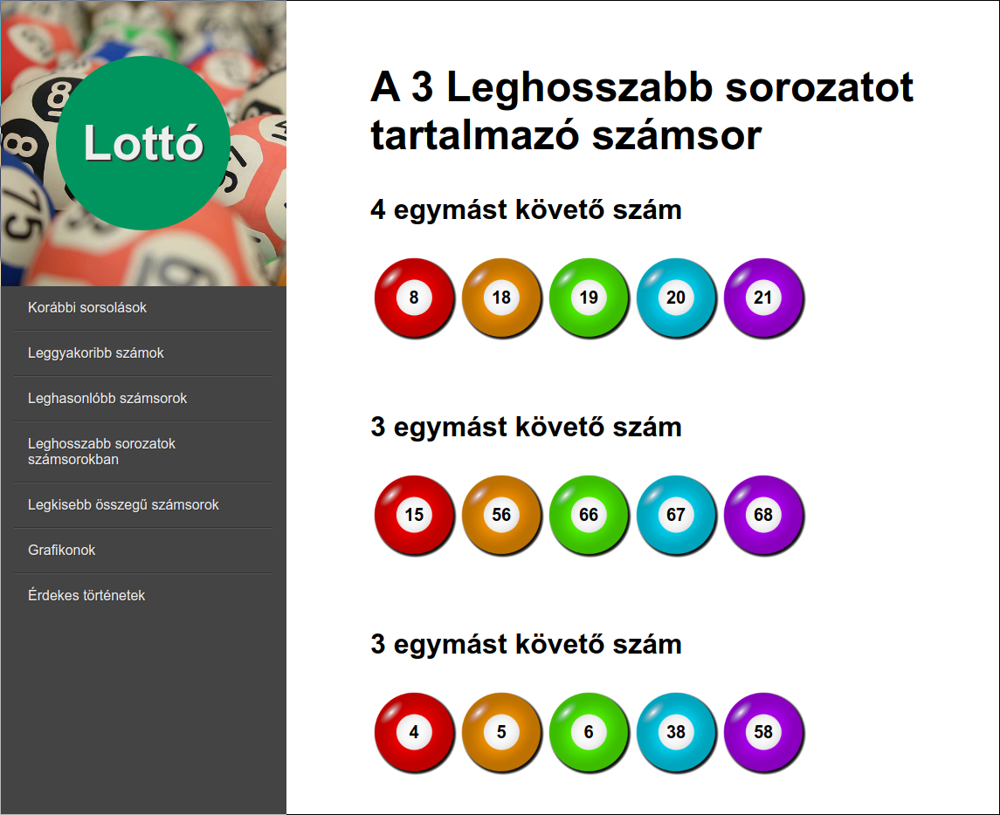
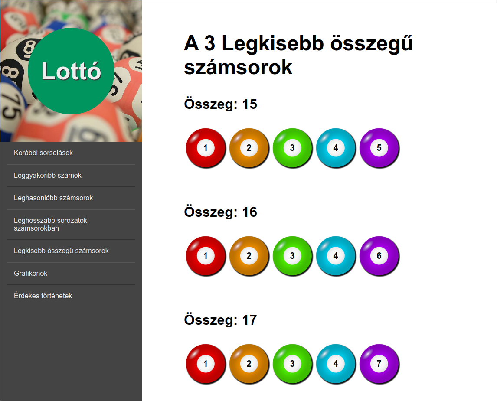

# Lottó Projekt

## Projekt a workshop alatt

A projekt alatt 4-6 fős csapatokban egy lottóval kapcsolatos statisztikai
web-oldalt fognak létrehozni a résztvevők.

A feladathoz szükséges készségek a csapatban (a csapat-munka eszközökön felül):

 - HTML és CSS fejlesztés
 - Képek méretezése és vágása
 - Ikonok színezése
 - Adat elemzés CSV file-okból
 - Dokumentáció készítése

### A web-oldal

A web-oldal statisztikákat mutat be a magyar ötös lottóról. A statisztikák a
1957 és 2020 közötti adatokra alapulnak, amik megtalálhatóak
[ebben a `csv` file-ban](otos.csv).

#### Főoldal

- A jobboldali menü elemei a másik aloldalakra vezetnek
- Az oldal a két legutolsó heti lottó eredményeket mutatja

#### Leggyakoribb számok

- Az oldal a 3 leggyakrabban kihúzott számot tartalmazza és azt, hogy hányszor
  lettek kihúzva.

#### Leghasonlóbb számsorok

- Az oldal azt a két számsort mutatja amelyek a legtöbb azonos számot
  tartalmazzák, ha több ilyen van, akkor csak abból kettőt mutat meg.
- A húzások dátumát is mutatja az oldal1

#### Leghosszabb sorozatot tartalmazó számsorok

- Az oldal azokat a húzás eredményeket tartalmazza, amikben a leghosszabb egymást
  követő számok sorozata található meg

#### Legkisebb összegű számsorok

- Az oldal azokat a húzás eredményeket tartalmazza, amik összeadva a legkisebb
  összegüek, és ezeknek az összegét

#### Grafikonok

- A csapat Excel vagy Google Spreadsheet segítségével hozzon létre grafikonokat, és azoknak
  a képeit jelenítse meg ezen az oldalon
- Legyen egy grafikon, ami az ötös találatok nyeremény értékét mutatja idó szerint
- Legyen egy grafikon, ami mind a 90 szám gyakoriságát mutatja

#### Érdekes történetek

- A csapat gyűjtsön igaz történeteket a lottó világáról, és a kedvenceit mutassa
  be ezen az oldalon

#### Dokumentáció

A projekthez készüljön dokumentáció markdown formátumban

#### GitHub Hosting

A weboldal kódja és hozzá tartozó file-ok mind kerüljenek fel a csapatnak egy közös
github repository-jára, az egyik résztvevő profilja alá.
Az oldal kerüljön ki az internetre ami a repository nevének megválasztásával oldható meg,
a kovetkező cikk alapján: <https://pages.github.com/>

#### Az oldalakhoz szükséges fontok, ikonok:

- Font: `arial`
- [Golyó ikon](assets/golyo.png)
- [Háttér kép](assets/hatter.jpg)

