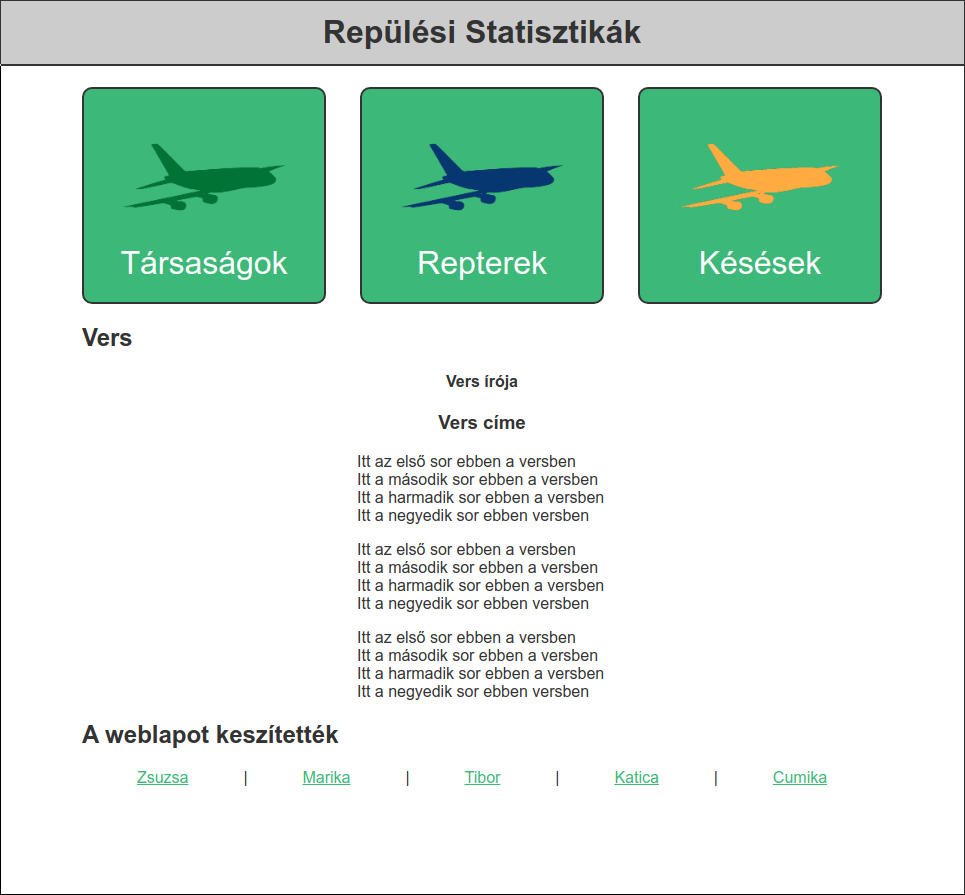
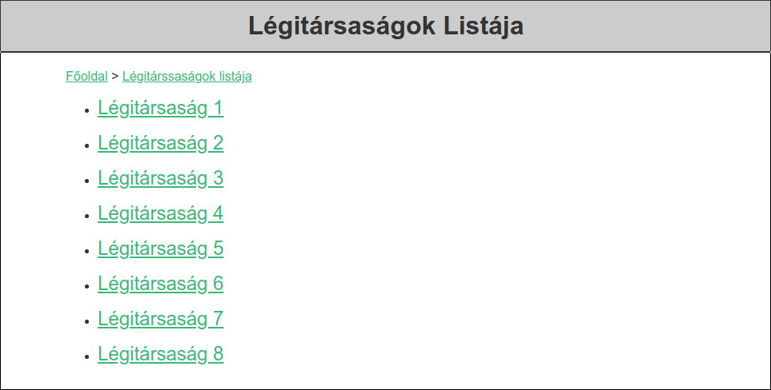
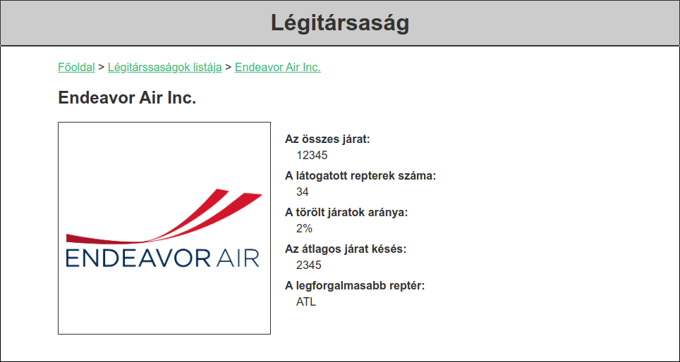
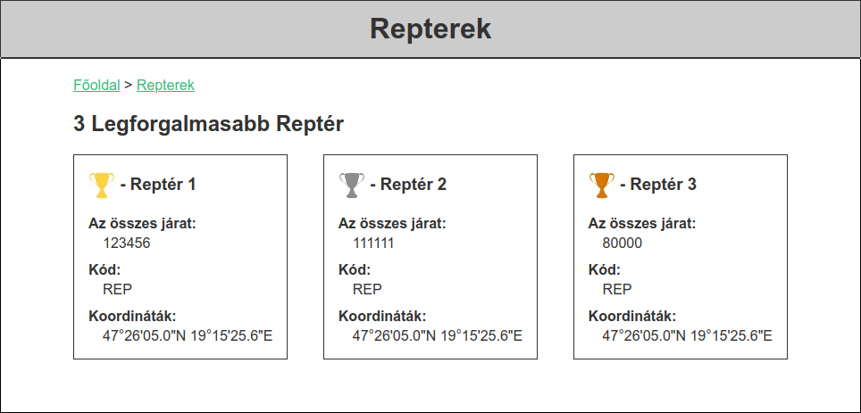
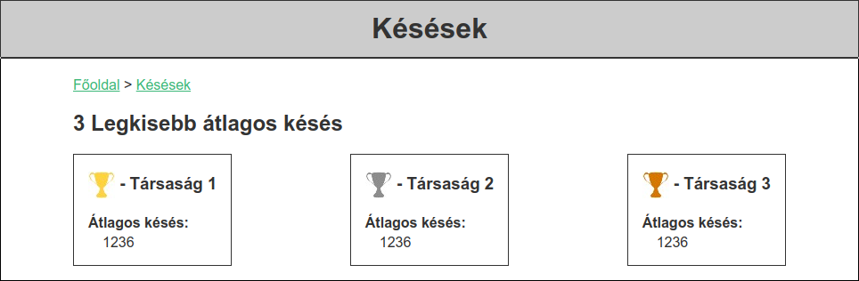

# Projektmunka

## Telepités

A fejlesztéshez szükséges Git telepítése.
A telepítő ezen a linken elérhető: <https://git-scm.com/downloads>
Telepéskor fontos, hogy a Git Bash-t is telepítsük.
A workshop alatt szükséges lesz, a következő oldalakra regisztráció:

- <https://github.com/>
- <https://trello.com/>

## Otthon megnézendő anyagok a gyakorlati nap előtt

| Tananyag | Hossz |
| -------- | ----- |
| [Git Alapismeretek 01. Bevezetés](https://www.youtube.com/watch?v=XDKZu9kuEn8) | 9:10 |
| [Git Alapismeretek 2. Verziókezelő fajták](https://www.youtube.com/watch?v=_DpBYNQwQmU) | 9:50 |
| [Git Alapismeretek 03. Git Init](https://www.youtube.com/watch?v=nOmw00Yh_to) | 9:17 |
| [Git Alapismeretek 04. A színpad](https://www.youtube.com/watch?v=KqdZ1B8sS8k) | 5:42 |
| [Git Alapismeretek 5. Távoli Repository](https://www.youtube.com/watch?v=X7rC62r9sGY) | 10:22 |
| [Git Alapismeretek 06. Kapcsolódási módok](https://www.youtube.com/watch?v=4NsHUDrD2ek) | 10:08 |
| [Git Alapismeretek 07. Diff, reset, checkout - fájl kezelés](https://www.youtube.com/watch?v=CCZ0Em1Vmdk) | 8:44 |
| [Git Alapismeretek 08. Branchek](https://www.youtube.com/watch?v=JXnep31gM4I) | 7:33 |
| [A Trello használata hatékonyan home office-ban 2020-as oktatóvideó kezdőknek](https://www.youtube.com/watch?v=jSMzo6bZGgU) | 25:06 |

## Projekt a workshop alatt

A projekt alatt 4-6 fős csapatokban egy repüléssel kapcsolatos statisztikai
web-oldalt fognak létrehozni a résztvevők.

A feladathoz szükséges készségek a csapatban (a csapat-munka eszközökön felül):

 - HTML és CSS fejlesztés
 - JavaScript fejlesztés
 - Képek méretezése és vágása
 - Ikonok színezése
 - Adat elemzés CSV file-okból
 - File olvasás és manipulálás szabadon választott programozói környezetben
 - Képek gyűjtése internetről
 - Dokumentáció készítése

### A web-oldal

A web-oldal statisztikákat mutat be Egyesült Államok beli repülőgép társaságokról
és repterekről. A statisztikák a 2019-02 és 2020-02 közötti adatokra alapulnak
amik megtalálhatóak [ebben a `csv` file-ban](assets/flights.csv).

#### Főoldal

- A 3 zöld doboz kattintható és másik aloldalakra vezet
- A vers szövege kódolt fájlokból kiolvasható, részletek lejjebb
- A készítők linkjei a saját elkészített önéletrajz oldalukra vezet
- A fejléc a teljes oldal szélességét kitölti
- Az oldal többi tartalma 800 pixel széles
- A repülő ikonok 200 pixel szélesek

#### Légitársaságok Listája

- A Főoldal link vissza vezet a főoldalra
- A Légitársaságok listája link ezen az oldalon marad
- A `flights.csv` file-ban található összes légitársaság legyen a listán
- Az egyes légitársaság linkek tovább vezetnek a légitársaság oldalakra

#### Légitársaság oldal

- A Főoldal link vissza vezet a főoldalra
- A Légitársaságok listája link vezet a Légitársaságok Listája oldalra
- A Légitársaság link ezen at oldalon marad
- A `flights.csv` file-ban található összes légitársaság legyen oldala
- A légitársaság logóját az internetről szükséges kikeresni és az oldalon középre igazítva 300 pixeles méretben jelenjen meg
- A szükséges adatok a `flights.css` fileból eredjenek, részletek lejjebb

#### Repterek oldal

- A Főoldal link vissza vezet a főoldalra
- A Repterek link ezen az oldalon marad
- Az oldalon a 3 legforgalmasabb reptér jelenik meg a `flights.csv` alapján, részletek lejjebb
- A repterek koordinátáit ay internetről szükséges kikeresni
- A kupa ikonok 30 pixelesek

#### Késések oldal

- A Főoldal link vissza vezet a főoldalra
- A Késések link ezen az oldalon marad
- Az oldalon a 3 legkisebb átlagos késés idővel rendelkező társaság jelenik meg a `flights.csv` alapján, részletek lejjebb
- A kupa ikonok 30 pixelesek

#### Önéletrajz oldalak

- Minden készítő adja hozza a saját önéletrajzát mint aloldal
- Mindenki a saját tudása szerint egy egyszerű `.txt` file is elegendő
- Ha valaki unatkozna nyugodtan élje ki a kreativitását :)

#### Adatok elemzése

- A `flights.csv` file Excel segítségével megnyitható mint táblázat
- A számolásokhoz szükséges adatok oszlopai:
  - `carrier`: A légitársaság kódja
  - `carrier_name`: A légitársaság neve
  - `airport`: A reptér kódja
  - `airport_name`: A reptér neve
  - `arr_flights`: Az érkező járatok száma
  - `arr_del15`: A késett járatok száma
  - `arr_delay`: A késések összesítve percben

#### Vers

A vers szövege több [`caesar.txt`](vers/caesar.txt) file-ban van lekódolva a [Caesar-rejtjel](https://hu.wikipedia.org/wiki/Caesar-rejtjel)
segítségével. A kódolás az angol ABC-t használja és eltolást értékét másik feladatok alapján kapjuk meg.
A többi feladat eredménye mind szám, feladatok eredményeinek összege a kódolás eltolásának értéke.
A feltörési feladatok megoldásához bármilyen programozási nyelvet használhatnak a résztvevők.

Az eltolás összegét megadó feladatok:

##### [count-x-y-w.txt](vers/count-x-y-w.txt)

Számoljuk össze (egy megírt program segítségével) hányszor szerepel a szövegben az `X`, `Y` és `W` karakter.
Az eredmény: `X_száma + Y_száma - W_száma`

##### [after-z.txt](vers/after-z.txt)

Keressük ki a file-ban a `Z` karakter után következő számjegy karatereket és az átlaguknak vegyük az egész részét.

##### Fibonacci 50

Az ötvenedik fibonacci szám legmagasabb helyiértékű számjegye kivonva a legkisebb helyiértéküből.
Ha a nulladik: 0, az első: 1.

#### Dokumentáció

A projekthez készüljön dokumentáció markdown formátumban

#### GitHub Hosting

A weboldal kódja és hozzá tartozó fileok mind kerüljenek fel a csapatnak egy közös
github repository-jára, az egyik résztvevő profilja alá.
Az oldal kerüljön ki az internetre ami a repository nevének megválasztásával oldható meg,
a kovetkező cikk alapján: <https://pages.github.com/>

#### Az oldalakhoz szükséges fontok, ikonok és szinek:

- Font: arial
- Fekete: `#333333`
- Szürke: `#cccccc`
- Világos zöld: `#3cb878`
- Sötét zöld: `#007335`
- Kék: `#063711`
- Sérga: `#ffab40`
- Arany: `#fed346`
- Ezüst: `#8d8d8d`
- Bronz: `#ce7402`
- [Repülő ikon](assets/airplane-icon.png)
- [Kupa ikon](assets/cup.jpg)

